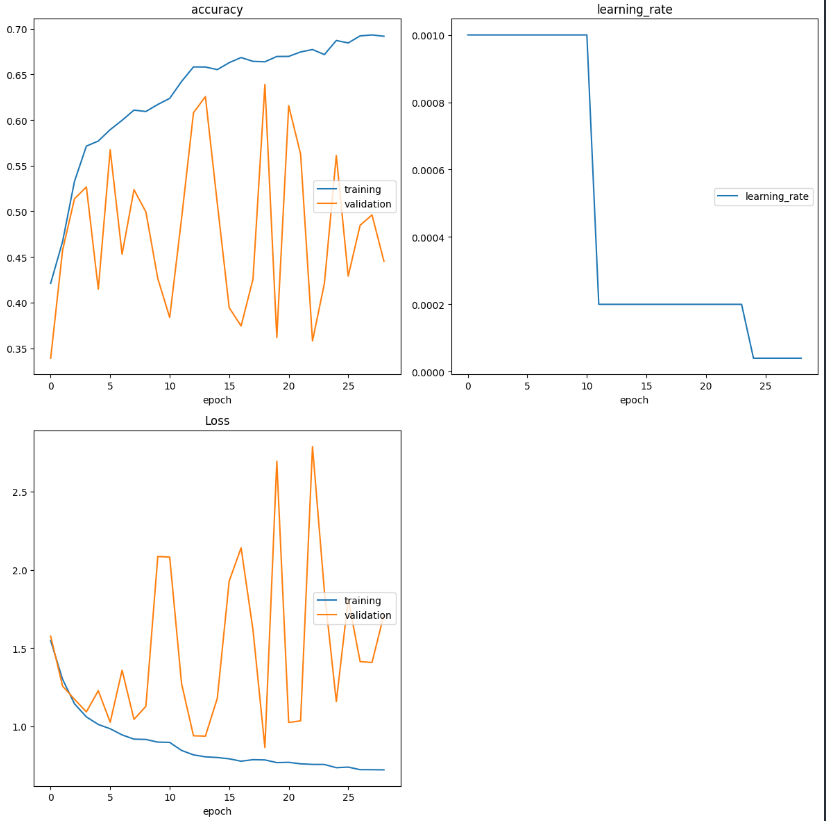

<h1>Realistic Image Classification using Deep Learning in Python on Kaggle</h1>
 
<h2>Features</h2>
<ul>
    <li>Classify images generated by deep generative models</li>
    <li> This is a three-way classification task in which an image must be classified into one of three classes</li>
    <li>The training data is composed of 10,500 image files</li>
    <li>The validation set is composed of 3,000 image files</li>
    <li>The test is composed of 4,500 image files</li>
    <li>Preprocessing: function for looping through each image name, read the image, and append it to the list</li>
    <li>Normalize data for the computer to read easily (values between 0 and 1)</li>
    <li>Creating the Model with CNN Architecture</li>
    <li>Data Augmentation</li>
    <li>Callbacks: checkpoint, earlyStopping, learning rate dynamic</li>
    <li>Accuracy: 0.65</li>
</ul>

<h2>Acknowledgments</h2>

<b> Python3: http://bit.ly/python3-certifications </b>
 
<b> Machine Learning: https://bit.ly/machine-learning-certification <b>
 

<h2> Link </h2>
<b> Kaggle: https://www.kaggle.com/competitions/realistic-image-classification</b>
 

<h2>Photo</h2>

 
<h2>Contact</h2>

<b> Email: mariusc0023@gmail.com </b>
